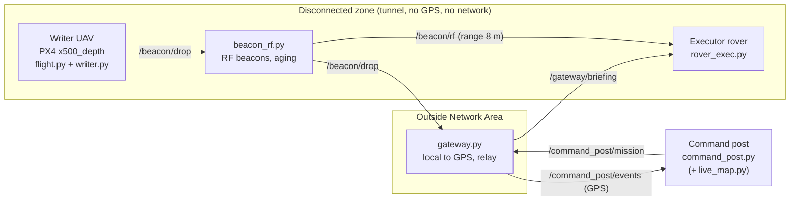

# The Living Map: Spatial Memory for Emergency Robots

**IEEE RAS x IEEE AESS Tunisia, TSYP14 Technical Challenge, Phase 1 (simulation)**
Environment: **Mine / Tunnel** (GPS-denied). Author: Aziz Marnissi.

A first robot (the **Writer**, a UAV) explores a disconnected tunnel, detects events and leaves **beacons**. An **Outside Network Area** (gateway) translates the data to GPS and forwards it to a distant **command post**. The command post briefs a second robot (the **Executor**, a rover), which enters the tunnel and navigates using the inherited beacon information.

---

## 1. Challenge compliance

| Requirement (brief) | Implementation | Status |
|---|---|---|
| Choose one environment | Mine / tunnel world (`worlds/mine_tunnel.sdf`) | Done |
| Detect at least 2 event types | Victim (person model) and fire (particle emitter) | Done |
| Writer robot, autonomous exploration | PX4 x500_depth UAV, offboard waypoint sweep (`flight.py`) | Done (scripted) |
| Beacon: what / where / when | `{type, pos, t, ttl}` then RF message with aging | Done |
| Message aging mechanism | TTL per type, confidence `exp(-age/ttl)`, `stale` flag, expiry | Done |
| Frame translation (private to GPS) | Flat-earth local to lat/lon in the gateway | Done |
| Outside Network Area | `gateway.py`, the only inside/outside bridge | Done |
| No direct robot to command-post link | Mission is relayed by the gateway to the rover | Done |
| Brief the Executor before entry | `/command_post/mission` then `/gateway/briefing` | Done |
| Executor navigates with beacons | `rover_exec.py` reads `/beacon/rf` within RF range | Done |
| Live map at command post | `live_map.py` (matplotlib) | Done (optional node) |

---

## 2. System architecture



### Data flow

1. **Explore:** `flight.py` flies the UAV along a fixed route through the tunnel and the side branch.
2. **Detect and localise:** `writer.py` segments the event in the RGB image, reads the range at the matching depth pixel, and projects it to a world position using the UAV pose and yaw.
3. **Deposit:** the writer publishes a beacon on `/beacon/drop`. Duplicates within `MIN_DIST` (5 m) of the same type are dropped.
4. **Broadcast:** `beacon_rf.py` arms each beacon and rebroadcasts it at 1 Hz on `/beacon/rf` with its current age, until its TTL expires.
5. **Forward:** `gateway.py` converts local metres to GPS, computes `stale` and `confidence`, and publishes to the command post.
6. **Mission:** `command_post.py` builds `{goto: [victims], avoid: [fires]}` from live (non-stale) events.
7. **Brief:** the gateway relays the mission to `/gateway/briefing`; the rover never talks to the command post directly.
8. **Execute:** the rover drives toward the briefed target, then switches to beacon guidance once a victim beacon is within RF range, and stops within 1.5 m.

---

## 3. Communication design

### Topics and links

| Topic | Type | Publisher | Subscriber | Meaning |
|---|---|---|---|---|
| `/beacon/drop` | `std_msgs/String` (JSON) | writer | beacon_rf, gateway | Beacon deposit event |
| `/beacon/rf` | `std_msgs/String` (JSON) | beacon_rf | rover_exec | Simulated RF broadcast (1 Hz) |
| `/command_post/events` | `std_msgs/String` (JSON) | gateway | command_post, live_map | Events in GPS frame |
| `/command_post/mission` | `std_msgs/String` (JSON) | command_post | gateway | Mission for the Executor |
| `/gateway/briefing` | `std_msgs/String` (JSON) | gateway | rover_exec | Mission relayed into the zone |
| `/exec/odom`, `/exec/cmd_vel` | `Odometry`, `Twist` | Gazebo bridge, rover | rover, Gazebo | Rover state and control |
| `/fmu/in/*`, `/fmu/out/*` | `px4_msgs` | flight | PX4 (via XRCE-DDS) | UAV offboard control |

### Message formats

```json
// Beacon drop (Writer)
{"type": "victim", "pos": [5.71, 0.03], "t": 1791015398, "ttl": 600}

// RF broadcast (compact, with aging and range)
{"id": "v0", "k": "victim", "p": [5.71, 0.03], "t": 1791015398, "age": 7, "r": 8.0}

// Event at the command post (after gateway translation)
{"type": "victim", "lat": 36.8065004, "lon": 10.1815876, "t": 1791015398,
 "ttl": 600, "stale": false, "confidence": 1.0}

// Mission
{"goto": [<victim events>], "avoid": [<fire events>]}
```

### Message aging

* TTL: fire 300 s, victim 600 s.
* `confidence = exp(-age / ttl)`; `stale = age > ttl`.
* `beacon_rf.py` deletes expired beacons; the command post ignores stale events.

### Frame translation

Flat-earth approximation around a fixed origin (`LAT0 = 36.8065`, `LON0 = 10.1815`):

```
lat = LAT0 + y / 111320
lon = LON0 + x / (111320 * cos(LAT0))
```

The rover applies the inverse transform and subtracts its spawn offset to obtain its odometry frame.

---

## 4. Nodes

| File | Role |
|---|---|
| `launch_all.sh` | Starts PX4 SITL + Gazebo, camera bridge, rover bridge, camera detector, QGroundControl (tmux) |
| `flight.py` | UAV offboard control: arm, climb to 1.5 m, waypoint route (setpoint ramp 0.4 m/s, 3 s pause per waypoint) |
| `writer.py` | Event detection, depth-based localisation, beacon deposition, duplicate suppression |
| `cam_ieee.py` | YOLOv8 camera detection overlay |
| `beacon_rf.py` | RF broadcast model: 1 Hz rebroadcast, aging, expiry, range field |
| `gateway.py` | Outside Network Area: local to GPS, staleness and confidence, mission relay |
| `command_post.py` | Builds missions from live events |
| `rover_exec.py` | Executor: mission goal, then beacon-guided navigation, stop at 1.5 m |
| `live_map.py` | Command-post live map (matplotlib), optional |
| `worlds/`, `models/` | Tunnel world and x500 / x500_depth / OakD-Lite models |
| `RUN_COMMANDS.md` | Terminal-by-terminal run commands |

---

## 5. Software stack

| Layer | Software |
|---|---|
| OS | Ubuntu 22.04 LTS |
| Robotics middleware | ROS 2 Humble (rclpy) |
| Simulator | Gazebo Harmonic (gz sim) |
| Flight stack | PX4-Autopilot (SITL), `gz_x500_depth` |
| PX4 to ROS 2 | Micro XRCE-DDS Agent, `px4_msgs` |
| Sim to ROS 2 | `ros_gz_bridge`, `ros_gz_image` |
| Ground station | QGroundControl |
| Perception | NumPy (colour segmentation + depth), YOLOv8 (Ultralytics), Gazebo depth camera 640x480 |
| Visualisation | Matplotlib |
| Tooling | Python 3.10, tmux, Git |

---

## 6. Installation and run

### Prerequisites

Ubuntu 22.04, ROS 2 Humble, Gazebo Harmonic, PX4-Autopilot (built once with `make px4_sitl gz_x500_depth`), Micro XRCE-DDS Agent, a workspace containing `px4_msgs`, QGroundControl.

```bash
git clone https://github.com/Aziz-Marnissi/ieee_project.git ~/living_map
cp ~/living_map/worlds/mine_tunnel.sdf ~/PX4-Autopilot/Tools/simulation/gz/worlds/
cp -r ~/living_map/models/* ~/PX4-Autopilot/Tools/simulation/gz/models/
```

### Run (one command per terminal)

```bash
# T0: simulator, bridges, camera, QGC (wait ~60 s)
~/living_map/launch_all.sh

# T1: DDS agent (check: ros2 topic list | grep -c fmu/in  ->  about 38)
MicroXRCEAgent udp4 -p 8888

# T2..T5: ground chain
source /opt/ros/humble/setup.bash && python3 ~/living_map/gateway.py
source /opt/ros/humble/setup.bash && python3 ~/living_map/command_post.py
source /opt/ros/humble/setup.bash && python3 ~/living_map/beacon_rf.py
source /opt/ros/humble/setup.bash && python3 ~/living_map/rover_exec.py

# T6: writer (wait for "writer up")
source /opt/ros/humble/setup.bash && export PROTOCOL_BUFFERS_PYTHON_IMPLEMENTATION=python && python3 ~/living_map/writer.py

# T7: autonomous flight (after "writer up")
source /opt/ros/humble/setup.bash && source ~/ws_sensor_combined/install/setup.bash && python3 ~/living_map/flight.py
```

Do not start nodes both from a launcher and by hand: duplicates produce duplicate beacons.

### Expected output

* `flight`: `WP 0` to `WP 4`, then `PATH DONE`.
* `writer`: `BEACON DROPPED` near the victim.
* `beacon_rf`: `BEACON ARMED`, one RF message per second with growing `age`.
* `gateway`: `FORWARDED`, then `BRIEFING relayed`.
* `command_post`: `MISSION goto=1`.
* `rover_exec`: `navigating by MISSION`, `RF beacon read`, `navigating by BEACON`, `ARRIVED`.

---

## 7. Results

* The UAV flies the whole route without manual control.
* The victim at (5.8, 0.6) was beaconed at (5.71, 0.03), about 0.6 m error when the UAV is close.
* The full chain Writer, gateway, command post, gateway, Executor works end to end; the rover reaches the victim guided by the beacon.
* A second person at (14, -0.5) is detected as a second victim at about (15.6, -0.8) (about 1.6 m depth error).

---

## 8. Failure cases and limitations

| Case | Behaviour / mitigation |
|---|---|
| Beacon TTL expired | Removed from RF; marked `stale` at the gateway; ignored by the command post |
| Executor out of RF range | Beacon ignored; the rover keeps navigating by the briefed mission |
| Duplicate detections | Same-type beacons within 5 m are dropped; the rover picks the nearest target |
| Depth error / long range | Position error grows with distance; the nearest-target rule limits the impact |
| Colour false positives | Thresholds can fire on similar colours; area threshold (`MIN_PIX`) reduces noise |
| Gateway down | No events or briefing pass; the rover has no mission (by design: no direct link) |
| DDS agent not connected | Offboard topics missing; the flight node cannot control the UAV |
| Duplicate nodes | Cause duplicate beacons; use a single launch method |

Known limitations: the Writer route is a scripted waypoint sweep, not reactive exploration; the `avoid` list (fire) is published in the mission but the rover does not yet use it for path planning.

---

## 9. Simulation stand-ins (to state in the report)

* The Gazebo world pose replaces on-board odometry/SLAM.
* The ROS topic `/beacon/rf` replaces the physical RF radio; range is enforced by the receiver.
* The tunnel local frame is anchored to GPS at a fixed origin (flat-earth approximation).

---

## 10. Repository layout

```
ieee_project/
  README.md  RUN_COMMANDS.md  launch_all.sh
  flight.py  writer.py  cam_ieee.py  beacon_rf.py
  gateway.py  command_post.py  rover_exec.py  live_map.py
  worlds/mine_tunnel.sdf
  models/{x500, x500_depth, OakD-Lite}
```
